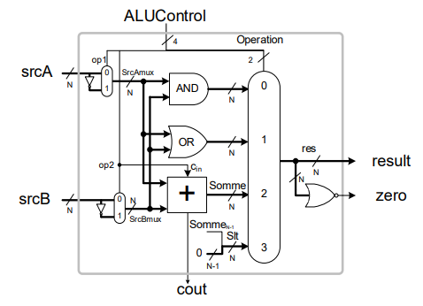

Dans le cadre du cours ELE344 (Conception et architecture de processeurs), j'ai dû réalisé une unité arithmétique et logique (UAL) 32bit dans le but de se servir de celle-ci dans un processeur MIPS.

## Qu'est-ce qu'un UAL? 

Un UAL est la portion d'un processeur qui fait les opérations demandées au processeur

## L'UAL de ce projet contient les fonctionnalités suivantes: 
  - AND : Opération "ET", cette opération compare deux valeurs binaires et retourne la valeur AND
  - OR  : Opération "OU", cette opération compare deux valeurs binaires et retourne la valeur OR  
  - ADD : Opération "Addition", cette opération additionne deux valeurs binaires et retourne la valeur de la somme
  - SUB : Opération "Soustraction", cette opération soustrait deux valeurs binaires et retourne la valeur de la différence
  - SLT : Opération "Set less then", cette opération compare deux valeurs et retourne 0 ou 1 si la valeur est inférieure à la valeur demandée

## Schéma de L'UAL

    

| Entrée  | Sortie |
| ------------- | ------------- |
| SrcA : entrée A sur N bit (32 bit dans le cas actuelle)  | Cout : Sortie de la résultante de l'addition si elle dépasse le nombre de bit |
| SrcB : entrée B sur N bit (32 bit dans le cas actuelle)  | Result : Sortie du résultat sur N bit (32 bit dans le cas actuelle)   |
| UALCrontrol : Signal de control, qui dicte l'opération demandé  | Zero : Signal qui prend la valeur 1 si le Result prend la valeur 0 |

## Architecture de L'UAL

    

